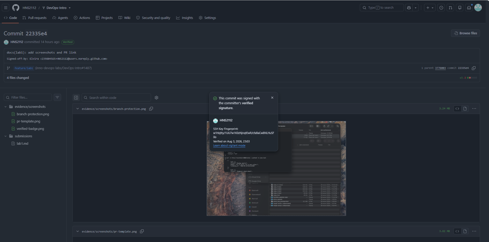
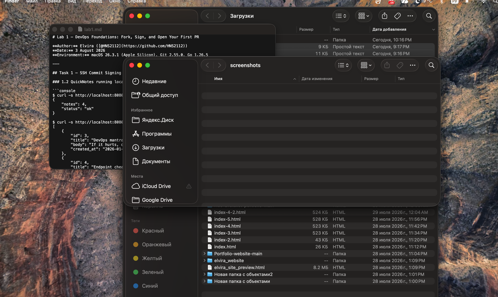
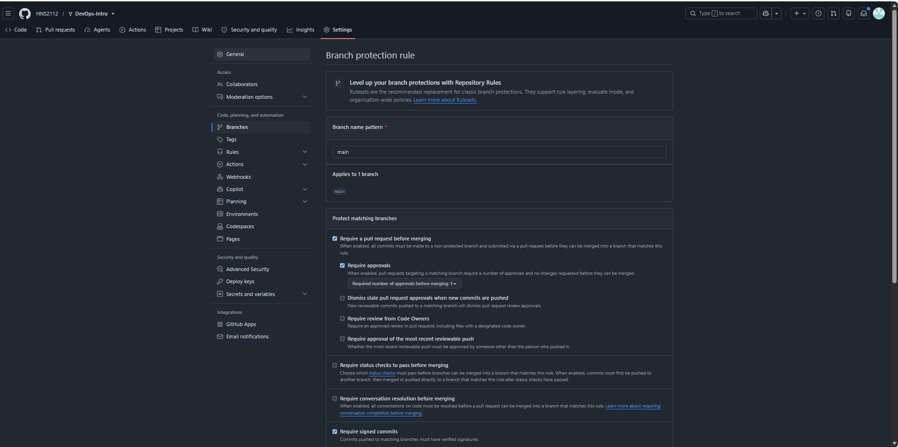
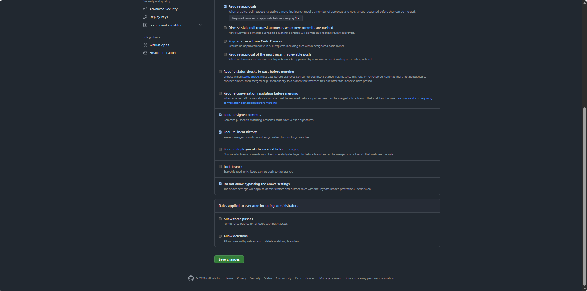

# Lab 1 — DevOps Foundations: Fork, Sign, and Open Your First PR

**Author:** HNS ([@HNS2112](https://github.com/HNS2112))
**Date:** 4 August 2026
**Environment:** macOS 26.3.1 (Apple Silicon) and Windows 11; Git 2.55.0, Go 1.26.5

---

## Task 1 — SSH Commit Signing & First Signed Commit

### 1.2 QuickNotes running locally

```console
$ curl -s http://localhost:8080/health | python3 -m json.tool
{
    "notes": 4,
    "status": "ok"
}

$ curl -s http://localhost:8080/notes | python3 -m json.tool
[
    {
        "id": 3,
        "title": "DevOps mantra",
        "body": "If it hurts, do it more often.",
        "created_at": "2026-01-15T10:10:00Z"
    },
    {
        "id": 4,
        "title": "Endpoint cheat-sheet",
        "body": "GET /notes  GET /notes/{id}  POST /notes  DELETE /notes/{id}  GET /health  GET /metrics",
        "created_at": "2026-01-15T10:15:00Z"
    },
    {
        "id": 1,
        "title": "Welcome to QuickNotes",
        "body": "This is the project you'll containerize, deploy, monitor, and harden across all 10 labs.",
        "created_at": "2026-01-15T10:00:00Z"
    },
    {
        "id": 2,
        "title": "Read app/main.go first",
        "body": "Start by understanding the entry point \u2014 env vars, signal handling, graceful shutdown.",
        "created_at": "2026-01-15T10:05:00Z"
    }
]

$ curl -s -X POST http://localhost:8080/notes -H 'Content-Type: application/json' \
    -d '{"title":"hello","body":"first POST"}' | python3 -m json.tool
{
    "id": 5,
    "title": "hello",
    "body": "first POST",
    "created_at": "2026-08-03T19:28:02.543864Z"
}

$ curl -s http://localhost:8080/notes | python3 -c 'import sys,json;print(len(json.load(sys.stdin)))'
5
```

`/notes` returns the 4 seed notes on the first request and 5 after `POST /notes`;
the new record was assigned `id: 5`.

Two things worth recording from this run:

1. **The seed file is resolved relative to the working directory.** In `main.go`
   the path comes from `envOrDefault("SEED_PATH", "seed.json")`, so launching the
   compiled binary from the repository root yields an empty store with no error
   at all — `ensureSeeded` simply fails to find the file and moves on. The
   correct invocation is from `app/`, as the lab states. This is a compact
   example of why a container image sets `WORKDIR` explicitly instead of relying
   on wherever the process happens to start.
2. **`GET /notes` does not return a deterministic order.** The notes came back as
   3, 4, 1, 2. The store iterates a Go map, and the randomised iteration order is
   deliberate — it stops clients from depending on a guarantee the language never
   made. For an API this means ordering has to be specified explicitly; any test
   asserting element order would otherwise be flaky.

### 1.4 Signed commit verification

```console
$ git log --show-signature -1
commit 00f698ea584fc5b9e7ea070a31fa868e01fd2970
Good "git" signature for 239804565+HNS2112@users.noreply.github.com with ED25519 key SHA256:w1hbjtty/1UU7w1K0zNjnqtEwR/cfaBaCw8NLHuSF0o
Author: Elvira <239804565+HNS2112@users.noreply.github.com>
Date:   Mon Aug 3 22:34:27 2026 +0300

    docs(lab1): QuickNotes run, SSH signing, PR template

    Signed-off-by: Elvira <239804565+HNS2112@users.noreply.github.com>
```

Note: earlier commits carry `user.name = Elvira`; it was later changed to `HNS` to match the GitHub handle. The signing key and committer email are unchanged, so verification is unaffected.

The line `Good "git" signature for ...` confirms the commit was signed with the
private key whose public half is registered on GitHub as a **Signing Key** and
listed in the local `allowed_signers` file.

One configuration detail that is easy to miss: `git log --show-signature` fails
with `gpg.ssh.allowedSignersFile needs to be configured` until that file exists.
It governs *verification*, not signing — the commit is signed correctly either
way, but Git has no trust anchor against which to check it.

### 1.5 Verified badge



### Why signed commits matter

In March 2024 a backdoor was found in `xz-utils` (CVE-2024-3094) that enabled
remote code execution through `sshd` on distributions linking `liblzma`. The
decisive detail is where the malicious code lived: not in the Git repository, but
in test fixtures inside the release tarballs the maintainer assembled by hand. It
was precisely this gap — between what the history showed and what was actually
shipped — that let the attack survive for months.

An honest assessment: commit signing would **not** have stopped this particular
attack. "Jia Tan" spent roughly two years building reputation and held legitimate
maintainer rights; those commits would have carried a valid signature. The value
of signing lies elsewhere. It makes every change non-repudiably attributable and
turns a supply-chain incident from "something was substituted somewhere" into a
concrete, auditable trail. Without a signature, editing `user.email` in
`git config` is enough to make a commit appear authored by any developer on the
project — and that is exactly the layer of trust on which code review and
blame-driven investigation rest.

---

## Task 2 — Pull Request Template & First PR

### 2.1 Template

`.github/pull_request_template.md` was committed to the **default branch**
(`main`) before the PR was opened — GitHub only reads templates from there. Both
the path and its case matter: `pull_request_template.md` (singular) or
`PULL_REQUEST_TEMPLATE.md`.

```markdown
## Goal
## Changes
## Testing
## Checklist
- [ ] Title is a clear sentence (<= 70 chars)
- [ ] Commits are signed (`git log --show-signature`)
- [ ] `submissions/labN.md` updated
```

### 2.2 PR

**PR URL:** https://github.com/inno-devops-labs/DevOps-Intro/pull/1487



The screenshot shows the PR creation form with the template sections already
filled in. Every commit in the PR carries the **Verified** badge and all
checklist items are ticked.

---

## Task 3 — GitHub Community

**Starred:** `inno-devops-labs/DevOps-Intro`, `simple-container-com/api`
**Following:** @Cre-eD, @Naghme98, @pierrepicaud, @G-Akleh, @Dnau15, @Ephy01

A star is more than a bookmark. Aggregate star counts act as a de facto trust
signal when picking a dependency, and a public list of starred repositories
describes a developer's technical profile more concretely than a line on a CV.

Following people turns the feed into a passive learning channel: you see which
tools colleagues actually reach for. It is also the same social graph that later
supplies reviewers, collaborators, and referrals.

---

## Bonus Task — Branch Protection & Required Signed Commits

### B.1 Rules




Enabled on `main` of my fork:

- Require signed commits
- Require a pull request before merging (1 approval)
- Require linear history
- Do not allow bypassing the above settings

The last one is the one people forget. Without it the repository owner can push
straight past every other rule, and the policy becomes decorative.

Machine-readable confirmation of the active rules:
[`evidence/branch-protection-api.json`](../evidence/branch-protection-api.json).

### B.2 Rejection

```console
$ git -c commit.gpgsign=false commit --no-gpg-sign -s --allow-empty \
    -m "test: unsigned commit (should fail)"
$ git push origin main
remote: error: GH006: Protected branch update failed for refs/heads/main.
remote:
remote: - Commits must have verified signatures.
remote:   Found 1 violation:
remote:
remote:   29421653cbdb10f2f9ed4b97ce52a4e28fd5fab0
remote:
remote: - Changes must be made through a pull request.
To github.com:HNS2112/DevOps-Intro.git
 ! [remote rejected] main -> main (protected branch hook declined)
error: failed to push some refs to 'github.com:HNS2112/DevOps-Intro.git'
```

Both rules fired at once: the missing signature and the attempt to bypass the
pull request. Signing was re-enabled afterwards and the unsigned commit was
discarded with `git reset --hard HEAD~1`.

Note: the lab handout gives `git commit -S=false`, which Git does not accept —
`-S` takes no `=` value. The working equivalents are `--no-gpg-sign` or
`git -c commit.gpgsign=false commit`.

### B.3 Reflection — Knight Capital

On 1 August 2012 Knight Capital lost roughly $440M in about 45 minutes: a release
was deployed by hand to eight servers, one of them did not receive the new code,
and there a repurposed feature flag reactivated eight-year-old dead code called
Power Peg, which began sending erroneous orders.

Branch protection and required signing would not have prevented this outage
directly — the root causes were a manual deployment with no verification, no
check that every node ran an identical artifact, and the reuse of a flag under
new semantics. The indirect effect is substantial, though. A mandatory pull
request before merging to the production branch would have put a second pair of
eyes on the flag being reused; required linear history plus signatures would have
given an unambiguous answer to "which commit is running on each server right
now" — and the team spent a meaningful share of those 45 minutes working out
exactly that. Branch protection is no substitute for automated deployment, but it
makes the state of the system verifiable, which is a precondition for a fast
rollback.

---

## Summary

| Task | Status |
|------|--------|
| Task 1 — SSH signing + QuickNotes | Complete |
| Task 2 — PR template + first PR | Complete |
| Task 3 — Community engagement | Complete |
| Bonus — Branch protection | Complete |
