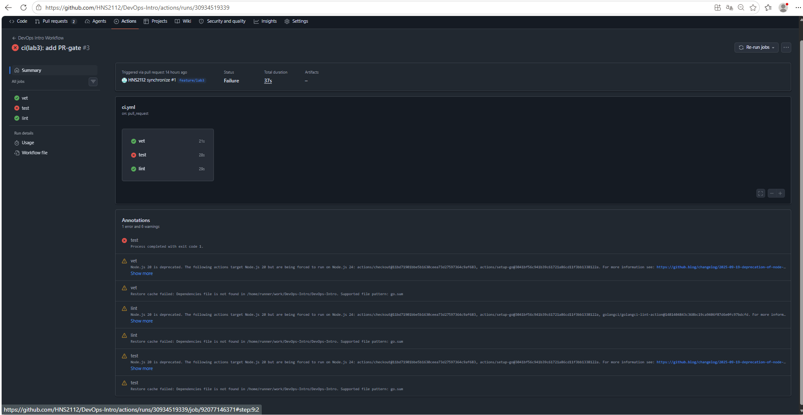
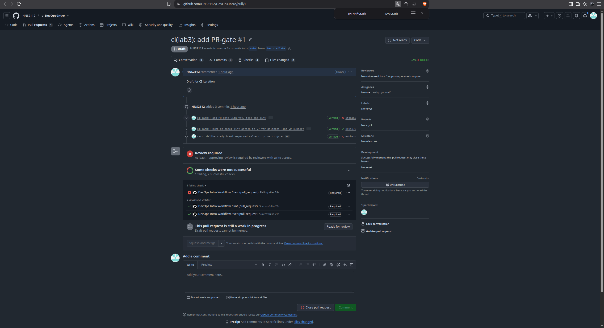
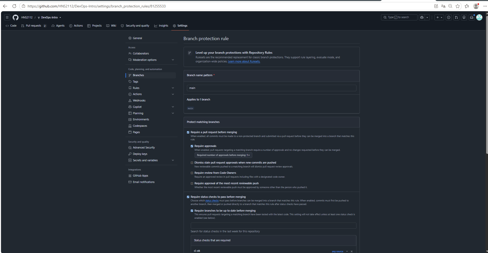
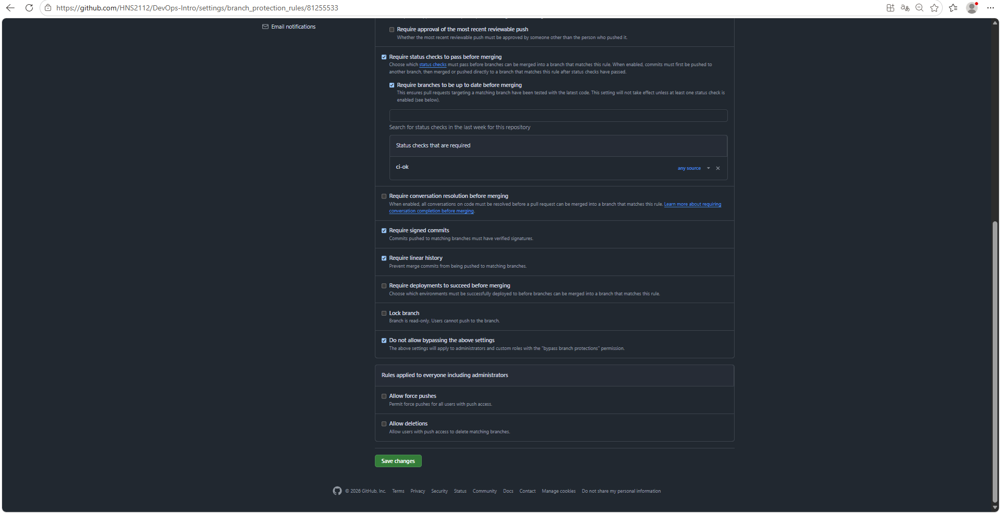
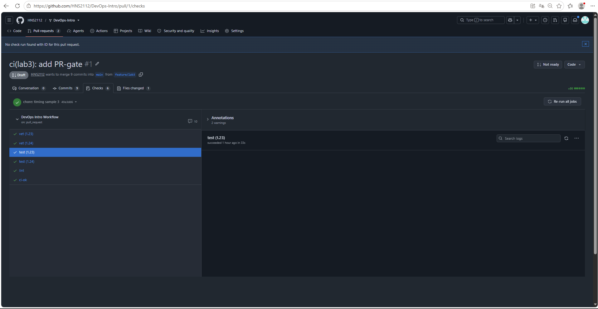
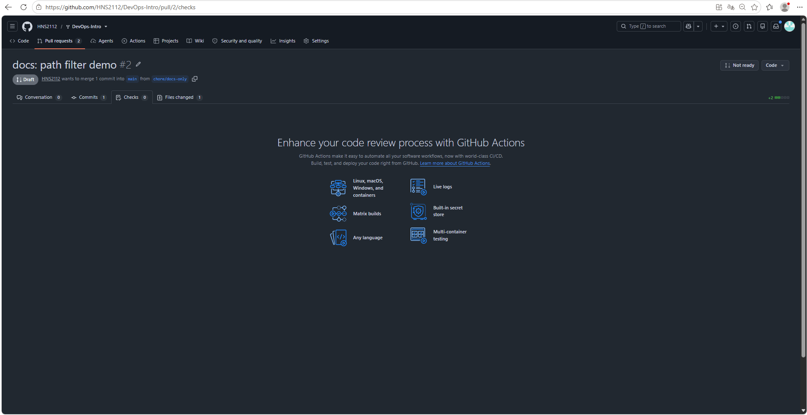

# Lab 3 — CI/CD: A PR-Gated Pipeline for QuickNotes

**Author:** HNS ([@HNS2112](https://github.com/HNS2112))
**Date:** 5 August 2026
**Path chosen:** GitHub Actions

GitHub Actions was the natural choice: the fork, the signed-commit setup and the
branch protection rules were already established in Labs 1 and 2, and the whole
course history lives on github.com. Switching to GitLab CI would have meant
rebuilding that context for no engineering gain.

---

## Task 1 — The PR Gate

### 1.1 Pipeline shape

Three independent jobs on `ubuntu-24.04`, all Go steps using `working-directory: app`:

| Job | Command |
|-----|---------|
| `vet` | `go vet ./...` |
| `test` | `go test -race -count=1 ./...` |
| `lint` | `golangci-lint` v2.5.0 (pinned) |

All third-party actions are pinned to a 40-character SHA with the tag noted in a
comment:

| Action | SHA | Tag |
|--------|-----|-----|
| `actions/checkout` | `11bd71901bbe5b1630ceea73d27597364c9af683` | v4.2.2 |
| `actions/setup-go` | `3041bf56c941b39c61721a86cd11f3bb1338122a` | v5.2.0 |
| `golangci/golangci-lint-action` | `1481404843c368bc19ca9406f87d6e0fc97bdcfd` | v7.0.0 |

`permissions: contents: read` is declared at the workflow level.

**Green CI run:** https://github.com/HNS2112/DevOps-Intro/actions/runs/30981055067

#### The action version was not free to choose

The first version used `golangci-lint-action` v6.5.2 and failed immediately:

```
invalid version string 'v2.5.0', golangci-lint v2 is not supported by
golangci-lint-action v6, you must update to golangci-lint-action v7.
```

The lab pins `golangci-lint` to v2.5.0, and only action v7+ can install a v2
linter. The two pins are coupled: fixing the tool version constrains the action
version that wraps it. Fixed in commit `8931976`.

Both tags for `golangci-lint-action` turned out to be *annotated* tags, so
`refs/tags/vX` resolves to a tag object rather than a commit. The 40-character
value in `uses:` had to be the dereferenced commit SHA — the same distinction
between annotated and lightweight tags that Lab 2 covered.

### 1.2 Design questions

#### a) Why pin `ubuntu-24.04` instead of `ubuntu-latest`?

Imagine a PR that has been open for a week. Yesterday's run was green; today's is
red, and nothing in the diff changed. The first reaction is "I broke something",
so the author starts re-reading their own changes — when the real cause is that
`ubuntu-latest` moved to a new runner image overnight. That is exactly the shift
visible as a warning in every one of my runs:

```
Node.js 20 is deprecated. The following actions target Node.js 20 but are
being forced to run on Node.js 24
```

The environment changed on its own, with no config change at all. The person ends
up hunting a bug that does not exist, instead of realising that comparing
yesterday's green run to today's red one is invalid — they are two different
environments hiding behind the same name.

Pinning `ubuntu-24.04` removes that source of false signals: if a run fails, the
cause is in the commit, not in something that was swapped out underneath. It does
not prevent the upgrade — it turns the upgrade into a separate, reviewable event.
Moving to a new LTS becomes a commit I write, that a reviewer sees, and that can
be reverted, rather than something that happens silently in the middle of someone
else's pull request. This is the same principle as SHA-pinning actions in (c),
applied to the runner instead of to the action.

#### b) Why split vet + test + lint into separate jobs?

With separate jobs I can see at a glance that only `test` broke while `vet` and
`lint` passed — so the problem is in the behaviour of the code, not in style or
typing. With one job running three commands in sequence, the first failing command
aborts the rest of the script, and everything after it never runs. I would have
seen "the job is red" and nothing more, with no way to know whether the linter
would have passed at all. Part of the diagnostic signal is simply lost.

Separation buys two other things beyond diagnosis. Parallelism: the three jobs run
at the same time, so wall-clock is the slowest unit rather than the sum of all
three — the run breakdown in §2.4 shows six jobs with the longest at 36 s
completing in 47 s total. And granularity in the gate: branch protection can
require each check by name, so the PR page shows precisely which unit failed to
report. That granularity is visible in the §1.5 screenshot, where all three checks
are individually marked **Required**.

#### c) What real attack does SHA pinning prevent?

**tj-actions/changed-files, 14 March 2025 (CVE-2025-30066).**

The attacker compromised a personal access token belonging to the maintainer bot
`@tj-actions-bot` and used it to place malicious code outside the action's own
repository. Then came the step that matters here: they rewrote all the release
tags — `v1`, `v35`, `v44.5.1` and the rest — to point at that malicious commit
instead of the original one. Tags are not immutable references; they are pointers
that the repository owner can redirect at any time. Every pipeline pinned to `@v35`
silently began executing someone else's code without a single edit to its own
workflow file.

The payload dumped environment variables out of the `Runner.Worker` process memory
and printed CI/CD secrets straight into the build logs. On public repositories
that meant anyone could simply read them. Over 23,000 repositories were affected.

Pinning by SHA defeats this specific attack, because a SHA *addresses content*:
you cannot change the code at that address without producing a different address.
This is the same content-addressed storage that Lab 2 examined at the object
level, where a rebase changed every commit SHA simply because the parent changed
while the content stayed identical.

**What SHA pinning does not give.** It stops substitution of already-released
code, but it does not stop a maintainer from honestly publishing a new, malicious
version under a new tag — and me from deliberately upgrading to it. So pinning
does not buy safety as such; it buys **control over when the update happens**. The
upgrade stops being automatic and becomes a deliberate act of mine, with a diff I
see before accepting it.

This lab contains a live example of that mechanism: the forced move of
`golangci-lint-action` from v6.5.2 to v7.0.0. I could not have drifted onto it by
accident — it went through an explicit diff in the config and is recorded as commit
`8931976`. With a floating `@v6` it would have happened by itself, without my
knowledge, on the next run.

#### d) What is `permissions:` and what principle is behind it?

`permissions:` controls what the `GITHUB_TOKEN` — the credential Actions mints
automatically for the duration of a run — is allowed to do. My workflow declares
`contents: read`, so the token can read the repository and nothing else.

Without an explicit declaration, the token's scope depends on a setting outside
the workflow file: Settings → Actions → General → Workflow permissions, which the
repository or organisation owner controls and which can be read-only or read/write.
So declaring `permissions:` explicitly is less about narrowing something broad and
more about **not depending on external configuration at all**. The workflow becomes
self-contained: move it to another repository with different defaults and its
behaviour does not change.

The principle is least privilege. If any step in the pipeline is compromised — for
instance through a third-party action, as in the tj-actions incident in (c) — it
inherits exactly the token's rights. With `contents: read`, a hijacked step
physically cannot push code, open releases, or alter repository settings, even
though it has taken control of the run.

`permissions:` can also be declared per job rather than per workflow. If one job
genuinely needed write access — say, to post a comment on the PR — the right move
is to grant it to that job alone rather than widening the whole workflow.

#### e) GitLab path — stages vs jobs

Not applicable: the GitHub Actions path was chosen.

### 1.5 Proving the gate blocks a broken PR

The deliberate breakage is a single line in `app/handlers_test.go` (commit
`e0bba39`):

```diff
-       if got["notes"].(float64) != 1 {
+       if got["notes"].(float64) != 99 {
```

CI result:

```
--- FAIL: TestHealth_ReportsCount (0.00s)
    handlers_test.go:53: notes count: 1
FAIL	quicknotes	0.015s
##[error]Process completed with exit code 1.
```

Failed run: https://github.com/HNS2112/DevOps-Intro/actions/runs/30934519339



Only `test` is red; `vet` and `lint` stayed green. The gate is selective — it
identifies which unit broke rather than reporting a single opaque failure.



All three checks are marked **Required**, and the **Squash and merge** button is
disabled. A second, independent rule fired as well — **Review required**, carried
over from the Lab 1 bonus — which shows that protection rules are evaluated
separately rather than as one combined gate.

Rollback: commit `a37c58e`; the following run is green again.

### 1.6 Branch protection





The required checks were initially `vet`, `test` and `lint`. After the matrix was
added (§2.2) they were replaced by the single `ci-ok` check — see §2.2b for why.

The second screenshot shows the rules carried over from Lab 1 that are still in
force alongside the new status-check requirement: signed commits, linear history,
and *Do not allow bypassing the above settings*, which applies every rule to the
repository owner as well.

---

## Task 2 — Faster and Smarter

### 2.1 Cache

`cache: true` and `cache-dependency-path: app/go.sum` are set in all three jobs.
Caching is active and verifiable in the run log — but there is nothing to cache:

```
Restore cache failed: Some specified paths were not resolved,
unable to cache dependencies.
```

Before `cache-dependency-path` was specified the message was different:

```
Restore cache failed: Dependencies file is not found in
/home/runner/work/DevOps-Intro/DevOps-Intro. Supported file pattern: go.sum
```

The change between the two messages is itself the evidence that the parameter was
picked up: the action stopped searching the repository root for any `go.sum` and
started looking for the specific path I gave it. It found nothing either way,
because `app/go.mod` has no `require` block and no `go.sum` exists — QuickNotes
has zero external dependencies. This is the expected result for this project, not
a misconfiguration.

### 2.2 The matrix does not actually test two Go versions

The matrix is `['1.23', '1.24']` with `fail-fast: false`, applied to `vet` and
`test`. The log of the 1.23 cell tells a different story from what the cell name
promises:

```
Setup go version spec 1.23
Successfully set up Go version 1.23
go version go1.23.12 linux/amd64
GOTOOLCHAIN='auto'
go: downloading go1.24.0 (linux/amd64)
```

`setup-go` did install Go 1.23 exactly as asked. But `app/go.mod` declares
`go 1.24`, and `GOTOOLCHAIN=auto` — the default since Go 1.21 — permits the
toolchain to fetch and switch to whatever version the module requires. So the cell
labelled "1.23" downloaded 1.24 and compiled with it. Both matrix cells built the
code with the same compiler.

The timings corroborate this: `vet` took 33 s versus 23 s and `test` 36 s versus
30 s across the two cells, differences well within the runner variance documented
in §2.4. The only real work unique to the 1.23 cell was downloading the toolchain
it then used instead of the one it was given.

So the matrix does not meet the goal §2.2 states — catching "works on my machine"
bugs that depend on the toolchain. It costs CI minutes and produces two checks,
but exercises one compiler. Making it real requires a choice, and both options
have a price. Lowering the `go` directive in `app/go.mod` to 1.23 would let both
cells run their own compiler, but it means editing upstream application code to
suit the pipeline. Setting `GOTOOLCHAIN=local` would keep the code untouched and
make the 1.23 cell fail loudly with a "module requires go >= 1.24" error — which
is arguably the more honest outcome, because it reports an actual incompatibility
rather than hiding it behind an automatic download. I left the default in place
and documented the behaviour instead of manufacturing a green matrix that proves
nothing.

### 2.2b The `ci-ok` aggregation job

Adding the matrix renames the checks: `test` becomes `test (1.23)` and
`test (1.24)`. The old context name never reports again, so a branch protection
rule still requiring `test` leaves the PR stuck on *"Expected — Waiting for status
to be reported"* forever, even with every real check green.

The fix is one aggregation job with `if: always()` and `needs: [vet, test, lint]`,
and only that job listed in the required checks.

`if: always()` is what makes this safe. Without it, a failed dependency causes
`ci-ok` to be **skipped** rather than run — and a skipped required check does not
block a merge on some configurations. The job must execute in every case
specifically so it can report a failure.

The condition tests for both `failure` and `cancelled` results. Those are distinct
states: with `fail-fast: true` a matrix cell that is aborted mid-flight is marked
cancelled, not failed, and an aggregation job that only looked for failures would
let it through.

Cost: `ci-ok` completes in 5 s.



The check list on the PR after the change: four matrix cells, `lint`, and the
`ci-ok` job that gates them. Only the last one is referenced by branch protection,
so the matrix dimensions can be changed later without touching repository
settings.

### 2.3 Path filter

```yaml
paths:
  - 'app/**'
  - '.github/workflows/**'
```

Demonstrated with PR #2 (`chore/docs-only`), which touches only the README.



`Checks 0`, `Files changed 1`, and `gh run list --branch chore/docs-only` returns
`no runs found`. No CI minutes were spent.

**Observation:** an empty commit pushed to `feature/lab3` (`ae51d4d`) *did* trigger
a run, even though it changed no files at all. Under a `pull_request` trigger the
path filter is evaluated against the diff of the entire pull request, not against
the last pushed commit. Since `feature/lab3` already contains changes under
`app/` and `.github/workflows/`, the PR keeps matching regardless of what the
newest commit contains. The filter saves CI time on docs-only *pull requests*, not
on docs-only *commits* within a code PR.

### 2.4 Timing table

| Scenario | Samples (s) | Median |
|----------|-------------|--------|
| Baseline — no cache, single Go version, no path filter | 31 | 31 (single sample) |
| With cache, no matrix | not measured | — |
| With cache + matrix | 38, 46, 47, 50, 56 | **47** |

Breakdown by job (run `30979866915`):

| Job | Duration |
|-----|----------|
| `vet (1.23)` | 33 s |
| `vet (1.24)` | 23 s |
| `test (1.23)` | 36 s |
| `test (1.24)` | 30 s |
| `lint` | 28 s |
| `ci-ok` | 5 s |

The most useful number here is the spread, not the median. Five runs of an
*unchanged* configuration ranged from 38 s to 56 s — an 18-second swing driven
entirely by runner provisioning and queueing. That is larger than the entire gap
between the baseline (31 s) and the final configuration (47 s), so attributing all
16 seconds to the matrix would overstate what was measured. Some of it is the
matrix and the `ci-ok` dependency, and some of it is noise.

The "with cache" row was deliberately left unmeasured rather than filled in. §2.1
establishes from the run log that there is nothing to cache on a project with zero
dependencies, so an isolated cache-only measurement would have captured runner
variance and nothing else — and with an 18-second spread it could easily have
"shown" caching making the pipeline slower. Reporting a number that cannot mean
what it appears to mean is worse than reporting that it was not measured.

The gap between the longest job (36 s) and total wall-clock (47 s) is the
remaining overhead: waiting for runners to be allocated for six jobs, plus `ci-ok`
which cannot start until all three dependencies finish.

### 2.5 Design questions

#### f) Why cache `go.sum`-keyed inputs and not build outputs?

`go.sum` is a deterministic key. It is a fixed list of hashes for every dependency
module, so identical `go.sum` content guarantees an identical set of downloaded
packages on any machine at any time. That is exactly what the cache key is derived
from — hence the `Restore cache failed` line in my log, since QuickNotes has no
`go.sum` at all.

More importantly, `go.sum` is a key I control. It is a readable, version-controlled
artifact sitting in the repository; I see it in a diff and can reason about when it
changes. A build cache key is assembled from a dozen internal factors — source
hashes, build flags, compiler version — none of which I manage and none of which I
can predict a hit or miss from. Caching inputs means caching something I pinned;
caching outputs means caching something the toolchain decides.

There is a second reason, independent of key stability. Downloading dependencies is
pure I/O: it is deterministic and skipping it changes nothing about the result.
Skipping compilation is different — it is giving up the check that the code still
builds. A cache that elides the actual work the CI exists to perform devalues the
CI itself.

#### g) What does `fail-fast: false` change, and when do you want `true`?

With `fail-fast: false` I see the result of every matrix cell independently. If
1.23 failed I would still learn whether 1.24 passed, and vice versa — which is the
difference between "this reproduces across toolchains" and "this is specific to one
build". With the default `fail-fast: true`, the first failing cell cancels the rest
and that distinction is lost.

Note that the others are *cancelled*, not skipped or failed — a distinct result
state, which is why the `ci-ok` condition in §2.2b checks for `cancelled` as well
as `failure`.

`fail-fast: true` is right when the full picture is not worth its price. In a large
matrix — several operating systems times several versions — with an obviously
systemic breakage (the code does not compile at all), there is no value in spending
CI minutes and wall-clock time waiting for every remaining cell to fail the same
way. You are paying runner time for information you already have.

#### h) Risk of cache poisoning from a malicious PR

Per GitHub's documentation (*Restrictions for accessing a cache*), caches are
branch-scoped: a workflow can read and write caches in the scope of its own branch,
and additionally read caches from the parent branch and the default branch. The
inheritance runs one way only — you can read downward, but you cannot write upward.

Under a `pull_request` trigger the run's cache is scoped to the merge ref
(`refs/pull/N/merge`), that is, to the pull request itself rather than to the target
branch. So even if an attacker's PR writes malicious content under a legitimate
cache key, that entry lands exclusively in the isolated scope of their own PR. A
subsequent run on `main` looking up the same key simply does not see it — it
searches only its own scope and the default branch, and the PR scope is not visible
to it. The only cache you can poison is the one belonging to the branch you are
writing from.

For pull requests originating from a fork the restriction is tighter still: the
token is read-only by default and cache writes are not available at all.

The real exposure is a different trigger. `pull_request_target` runs in the context
of the *base* branch, with its permissions and its cache scope, while checking out
code proposed by the contributor. That combination is what turns an untrusted PR
into a write into a trusted scope. My pipeline uses `pull_request` and is therefore
not exposed, but the distinction between the two triggers is precisely where this
class of mistake happens.

---

## Bonus Task — Performance Investigation

### B.1 Per-step profiling

The slowest job in the baseline run (`30991194718`) was `test (1.23)` at 36 s.
Its step breakdown:

| Step | Duration |
|------|----------|
| Set up job | 1 s |
| Checkout repository | 1 s |
| Setup Go compiler | 8 s |
| **Run unit tests** | **22 s** |
| Post Setup Go compiler | 0 s |
| Post Checkout repository | 1 s |
| Complete job | 0 s |

This reordered the optimisation plan. The obvious candidate — a shallow clone —
turned out to be pointless: checkout already takes 1 s. The dominant cost is the
test run itself, at 22 of 36 seconds.

The reason is `-race`. The race detector recompiles the package with
instrumentation and slows execution by roughly an order of magnitude; the same
tests run locally in 0.015 s. That cost is deliberate and not worth removing —
it is the whole reason the flag is in the pipeline.

Job-level baseline (same run, 63 s wall-clock total):

| Job | Duration |
|-----|----------|
| `test (1.23)` | 36 s |
| `vet (1.23)` | 28 s |
| `test (1.24)` | 25 s |
| `lint` | 24 s |
| `vet (1.24)` | 22 s |
| `ci-ok` | 4 s |

The 1.23 cells are consistently 8–11 s slower than their 1.24 counterparts. That
gap is the toolchain download described in §2.2 — more evidence that the cells
are not testing what their names claim.

### B.2 Three optimisations

**1. Drop the matrix from `vet`.** This follows directly from the §2.2 finding
rather than from a generic checklist. Both matrix cells compile with Go 1.24
regardless of what `setup-go` installs, so `vet (1.23)` and `vet (1.24)` run the
identical analysis on identical bytecode. One of them is pure waste. The matrix
is kept on `test`, where the assignment requires it.

**2. `GOFLAGS: -buildvcs=false`** at the workflow level. Stops the Go toolchain
from stamping VCS metadata into build artifacts, which removes a set of `git`
invocations from every build and vet run.

**3. `fetch-depth: 1`** on all three checkouts. Fetches only the tip commit
instead of the full history.

### B.3 Before / after

Wall-clock, measured across multiple runs of each configuration:

| Configuration | Samples (s) | Median |
|---|---|---|
| Before optimisation | 38, 46, 47, 50, 56 | **47** |
| After optimisation | 42, 46, 50 | **46** |

Job count dropped from six to five. Post-optimisation job breakdown
(run `31038150857`):

| Job | Duration |
|-----|----------|
| `test (1.23)` | 41 s |
| `test (1.24)` | 29 s |
| `lint` | 23 s |
| `vet` | 21 s |
| `ci-ok` | 2 s |

### B.4 Bottleneck analysis

The headline number is a one-second improvement in median wall-clock, which is
indistinguishable from noise — the spread on an unchanged configuration is 18
seconds. Read naively, the optimisations did nothing.

That reading is wrong, and the distinction matters. Removing `vet (1.23)`
eliminated 28 seconds of runner work and one runner slot per pipeline run. What
it did not do is shorten the critical path, because `vet` was never on it: the
five jobs run in parallel, so wall-clock equals the slowest job plus scheduling
overhead plus `ci-ok`. The slowest job is `test (1.23)` at 36–41 s, and nothing
in this optimisation set touches it.

So the correct claim is that **CI minutes were saved, not developer waiting
time**. On a private repository that is a direct billing reduction and it scales
with every push; for a developer watching the PR page it changes nothing.

The two remaining optimisations were measured honestly and produced no visible
effect. `fetch-depth: 1` cannot help when checkout already costs 1 s — the
repository is small and the runner's network is fast. `GOFLAGS=-buildvcs=false`
saves a handful of `git` calls, which is below the resolution of the measurement.
Both are correct practice and would matter on a large repository; here they were
kept and reported as measured rather than dressed up.

Shortening the critical path would require attacking `test (1.23)` itself. The
options are all trade-offs rather than free wins: dropping `-race` would be
faster and materially worse, since race detection is a large part of what the
gate is for; splitting tests across parallel jobs adds fixed per-job overhead of
roughly 10 s, which exceeds the current test time; and removing the 1.23 matrix
cell — the honest option, given §2.2 shows it compiles with 1.24 anyway — is
blocked by the assignment requiring the matrix on `test`.

---

## Summary

| Task | Status |
|------|--------|
| Task 1 — PR gate with vet + test + lint | Complete |
| Task 2 — cache, matrix, path filter | Complete |
| Bonus — performance investigation | Complete |
